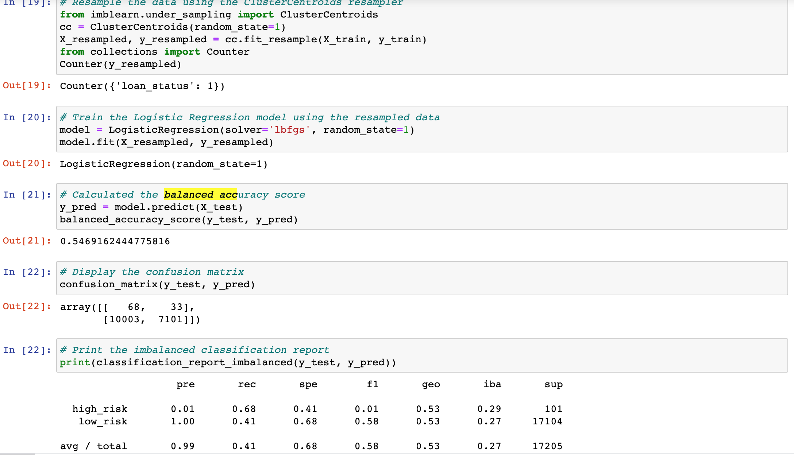

# Credit_Risk_Analysis

## Overview and Purpose

Credit risk is an inherently unbalanced classification problem, as good loans easily outnumber risky loans. Therefore, you’ll need to employ different techniques to train and evaluate models with unbalanced classes. In this project I am tasked with trying multiple different undersampling techniques in order to retrive a lgistic regression. After deploying multiple different techniques, SMOTEENN and Balanced Random Forest classifier will be use to model the algorithm. The purpose of this analysis is to experiment with creating a machine learning model that would most accurately predict credit risk by applying multiple different models and looking at the analysis in order to determine which is the best fit.

## Results
### Logistic Regression (LR) Naive Random Oversampling

### LR with SMOTE

### LR with Undersampling (Cluster Centroid)

### LoR with SMOTEENN

### Balanced Random Forest Classifier

### AdaBoost

## Summary

Based on all of the analysis and testing it seems as if the AdaBoost performed the best across all three metrics. They key metric that it performed best on was recall, recall is far more important than precision for this task. While AdaBoost preformed the best in the average of all metrics and cahgt 93% of the fraud cases, its still lacks precision which is a distinguishing factor in uncovering all of these cases. While there may be some flaws in AdaBoost, it seems like it is the best model for our data in order to catch the most fraud claims.
